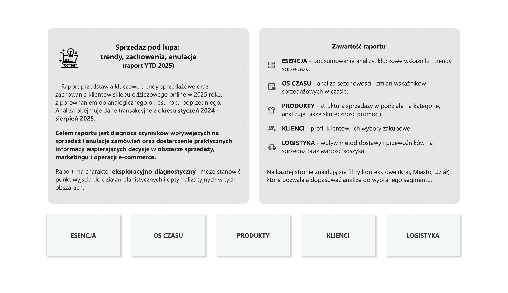
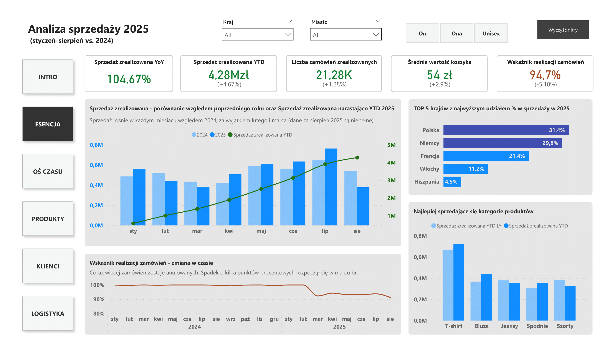
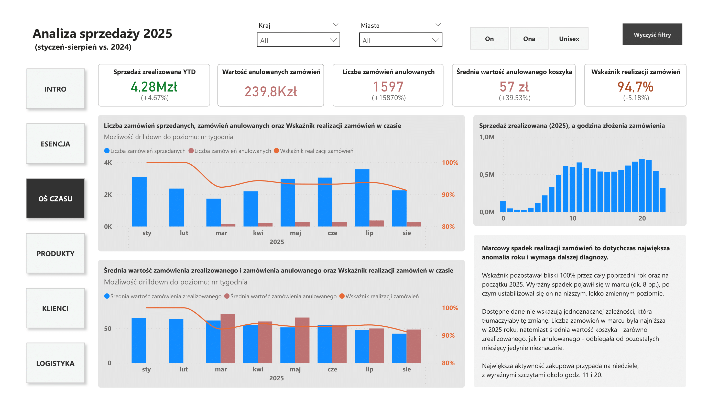
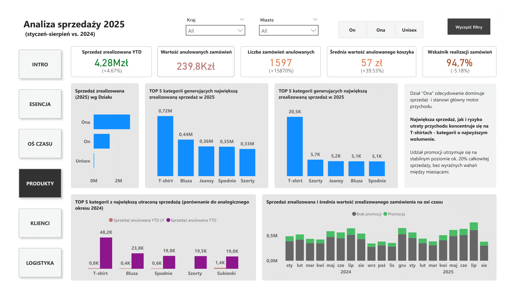
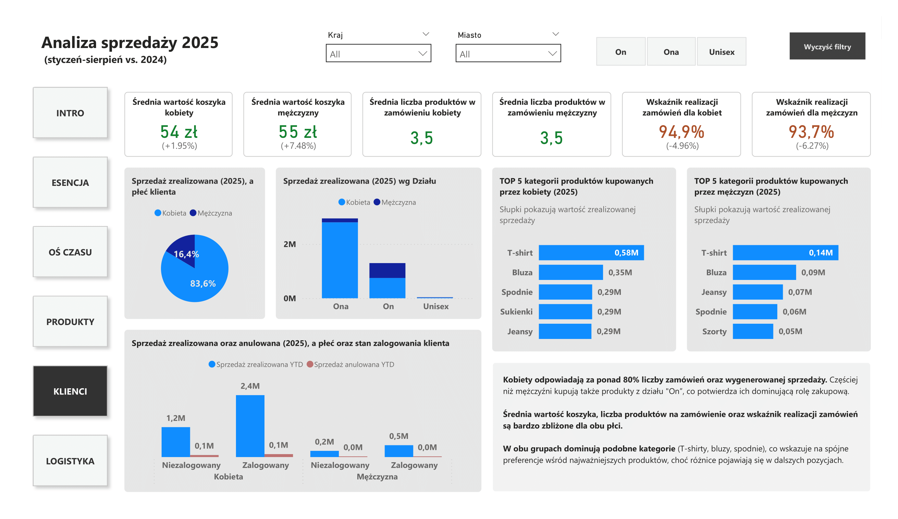
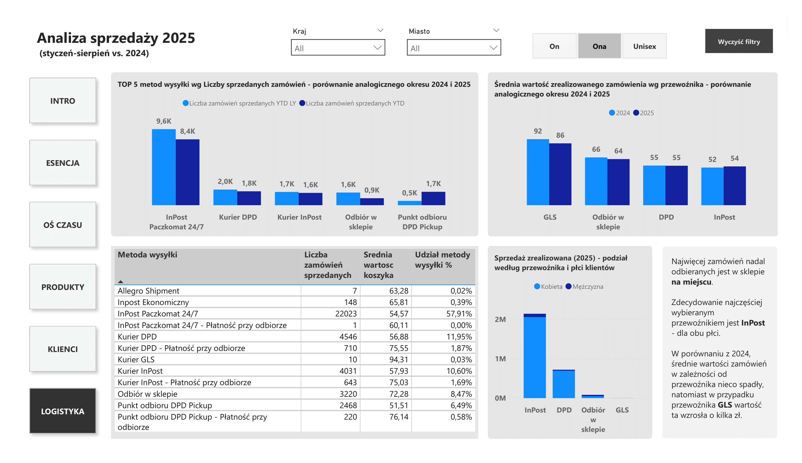

# Analiza wyników sprzedaży e-commerce (2024-2025)

Analiza obejmuje sprzedaż w sklepie odzieżowym online od stycznia 2024 do sierpnia 2025, z głównym naciskiem na wyniki z 2025 roku. Oparta na ponad 186 tys. rekordów transakcyjnych, koncentruje się na dynamice sprzedaży, sezonowości, zachowaniach klientów oraz czynnikach wpływających na realizację i anulacje zamówień. Ma charakter diagnostyczny i strategiczny, wskazując obszary możliwych usprawnień - od procesów operacyjnych i UX, po zarządzanie kategoriami i logistykę dostaw.

👉 [Link do raportu on-line](https://app.powerbi.com/view?r=eyJrIjoiM2MxMTAwMmQtYWMxMi00NmZkLWJhZmYtZDIyYmVjMjEyODI5IiwidCI6IjE1YzIyNjQ2LTU5M2YtNDMxOC04NTYzLTMwZmU5ZmRmMDdjZSJ9)

Podgląd każdej ze stron raportu:

| Page 1 | Page 2 |
|--------|--------|
|  |  |

| Page 3 | Page 4 |
|--------|--------|
|  |  |

| Page 5 | Page 6 |
|--------|--------|
|  |  |

## 1. Podsumowanie wykonawcze

Pierwsze osiem miesięcy 2025 potwierdzają stabilny trend wzrostowy. Sprzedaż wzrosła o 4,5% r/r, mimo spadku wskaźnika realizacji o 5,2 p.p., co oznacza istotną utratę potencjalnych przychodów. Najważniejszym motorem sprzedaży pozostaje segment "Ona", odpowiadający za ~70% wyników sprzedażowych i jednocześnie generujący najwyższy poziom anulacji, szczególnie w kategoriach o dużym wolumenie, jak T-shirty.

Spadek realizacji może kosztować sklep setki tysięcy złotych rocznie, mimo utrzymującego się popytu.

**Najważniejsze wnioski strategiczne:**

- **Poprawa procesu realizacji zamówień** to największa dźwignia wzrostu - spadek o 5 p.p. przekłada się na realną utratę przychodów. Optymalizacja prognoz stanów magazynowych i przepływu zamówień mogłaby szybko poprawić wyniki.

- **Wysokie anulacje w kluczowych kategoriach**, takich jak T-shirty, sugerują wyzwania operacyjne, których zaadresowanie może znacząco zmniejszyć liczbę anulacji w najbardziej dochodowych kategoriach.

- **Promocje zwiększają wolumen transakcji, ale obniżają średnią wartość koszyka.** Warto wprowadzić bardziej ukierunkowane mechanizmy rabatowe (progi kwotowe, selektywne kategorie, krótsze akcje promocyjne).

- **Segment "Ona" pozostaje kluczowym motorem sprzedaży.** Dalsze działania w obszarze contentu na stronie www, rekomendacji i sprzedaży krzyżowej (cross-sell) mogą wzmocnić wzrost.

- **Zakupy dokonywane przez zalogowanych użytkowników** generują ponad dwukrotnie większą sprzedaż niż zakupy anonimowe. Wzmocnienie zachęt do logowania może poprawić retencję i wyniki sprzedażowe.

## 2. Zakres projektu

**Cel analizy:** Identyfikacja trendów sprzedażowych, przyczyn anulacji zamówień oraz czynników wpływających na zachowania zakupowe klientów, w celu wskazania działań optymalizacyjnych.

**Zakres danych:**  
- Transakcje e-commerce: **186 443 rekordy**  
- Okres: **1 stycznia 2024 - 23 sierpnia 2025**  
- Wymiary: czas, produkt, dział sprzedaży, kategoria produktu, płeć klienta, status zalogowania, metoda płatności, kraj, miasto, sposób dostawy

**Narzędzia:**  
- Dane (pochodzące z pliku Excel) zostały wcześniej oczyszczone i przygotowane do analizy  
- **Power BI**: model danych, miary DAX, wizualizacje interaktywne  

## 3. Charakter danych

Analiza obejmuje wartość i status zamówień, szczegółowe informacje produktowe, sezonowość, a także aspekty logistyczne. Wielkość zbioru pozwala wiarygodnie uchwycić kluczowe trendy, sezonowość oraz zidentyfikować ryzyka operacyjne.

## 4. Kluczowe wskaźniki (YTD 2025)

| KPI | Wartość | r/r | Znaczenie |
|-----|--------:|----:|-----------|
| **Sprzedaż zrealizowana** | 4,28 mln zł | +4,5% | wzrost przy pogarszającej się realizacji |
| **Liczba zrealizowanych zamówień** | 21,2 tys. | +1,3% | rosnący wolumen |
| **Średnia wartość koszyka** | 56 zł | +2,9% | lekki wzrost wartości transakcji |
| **Wskaźnik realizacji** | 94,7% | −5,2 p.p. | sygnał rosnących anulacji |

## 5. Główne obszary analizy

### 5.1. Wyniki sprzedaży
Trend sprzedaży pozostaje wzrostowy, z dominującymi rynkami w Polsce i Niemczech. Porównania rok do roku pokazują przewagę 2025 w większości miesięcy. Spadek wskaźnika realizacji generuje stratę około **5% potencjalnego przychodu**, co wskazuje na obszar wymagający interwencji operacyjnej.

### 5.2. Sezonowość i rytm zakupów
Anulacje w 2025 roku miały wartość ~**240 tys. zł**, z wyraźnym wzrostem zapoczątkowanym w marcu. Średnia wartość koszyka jest stabilna i nie zależy istotnie od dnia tygodnia ani godziny. Najwięcej transakcji przypada na niedziele, z dwoma pikami: około 11:00 i 20:00. Interesujące jest, że koszyki anulowane mają średnio nieco wyższą wartość, niż koszyki zrealizowane.

### 5.3. Produkty
Segment **"Ona"** generuje ~70% całkowitej sprzedaży. Najpopularniejsze kategorie to **T-shirty, Bluzy, Jeansy, Spodnie i Shorty**.  
**T-shirty** odpowiadają za najwyższy wolumen sprzedaży, ale jednocześnie najwyższe anulacje. Problem może wynikać z błędów w stanach magazynowych, nieprecyzyjnej rozmiarówki lub niewystarczającej jakości zdjęć/UX na stronie internetowej sklepu.  

Promocje zwiększają liczbę transakcji, ale obniżają średnią wartość koszyka, co pokazuje konieczność optymalizacji mechanizmów rabatowych.

### 5.4. Klienci i zachowania zakupowe
Kobiety odpowiadają za ponad 80% przychodu, dominują także w kupnie produktów z działu "On". Wskaźniki realizacji i średnia wartość koszyka są zbliżone dla obu płci. Użytkownicy zalogowani dokonują zakupów **ponad 2× częściej** niż niezalogowani, a Przelewy24 stanowią stabilnie około 88% wszystkich transakcji.

### 5.5. Logistyka i dostawy
Najpopularniejszą formą dostawy pozostaje **odbiór w sklepie**, a najczęściej wybieranym przewoźnikiem jest **InPost**. Porównanie rok do roku wskazuje na lekki spadek średniej wartości koszyka u większości przewoźników - wyjątek stanowi **GLS**, u którego wartość koszyka wzrosła.

## 6. Najważniejsze wnioski biznesowe

1. **Poprawa procesu realizacji zamówień** w newralgicznych miesiącach, takich jak marzec, może znacząco zwiększyć przychód. Spadek wskaźnika realizacji zamówień o 5 p.p. oznacza realną utratę sprzedaży, nawet przy stabilnym popycie.  

2. **Segment "Ona" pozostaje priorytetem inwestycyjnym.** Wysoki wolumen i rentowność tego segmentu wymagają dalszych działań marketingowych, w tym lepszego contentu, rekomendacji i sprzedaży krzyżowej (cross-sell).  

3. **Najwyższe anulacje w kategorii T-shirt** wskazują na problemy operacyjne, jak np. nieprecyzyjne stany magazynowe, błędy w rozmiarówce, czy niewystarczająca jakość zdjęć lub UX wyboru rozmiaru. Rozwiązanie tych kwestii może obniżyć liczbę anulacji w najbardziej dochodowych kategoriach.  

4. **Promocje zwiększają ruch, ale obniżają średnią wartość koszyka.** Sklep sprzedaje więcej sztuk, ale zarabia mniej na pojedynczym zamówieniu. Optymalizacja mechanizmów rabatowych (promocje selektywne, rabaty od progu kwotowego, krótsze kampanie) pozwoli utrzymać wolumen sprzedaży, a jednocześnie zwiększyć marżę.  

5. **Zakupy dokonywane przez zalogowanych klientów** generują ponad 2× więcej transakcji. Rozwój programu lojalnościowego i komunikacja korzyści z logowania może zwiększyć retencję i wartość koszyka.  

6. **Zmiany w średniej wartości zamówienia u przewoźników** mogą sugerować migrację klientów do tańszych form dostawy - warto monitorować te zmiany i dostosowywać ofertę logistyczną.

## 7. Podsumowanie

Analiza sprzedaży obejmuje pełen obraz sklepu online w ujęciu 18 miesięcy - od sezonowości i dynamiki sprzedaży, przez zachowania klientów, aż po logistykę i ryzyka operacyjne. Raport może służyć jako podstawa do decyzji strategicznych, optymalizacji operacyjnej, planowania promocji i działań marketingowych, a także jako punkt wyjścia do dalszych analiz zwiększających sprzedaż.
